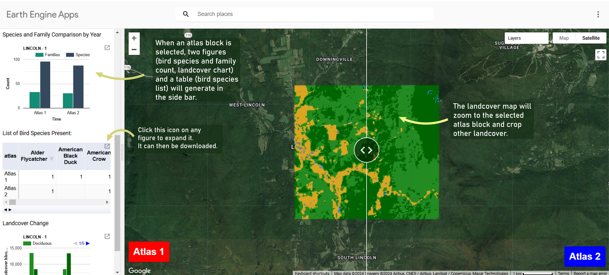

# Exploratory Steps in Understanding Relationships Between Bird Diversity and Landcover Change

## Introduction

Since 1970, the national bird population has decreased by nearly three billion, with more than 90% of the losses coming from just 12 families, including songbirds such as sparrows, blackbirds, warblers, and finches (Rosenberg et al.). A multitude of factors led to this decline, including invasive species, pollution, window strikes, and feral cats. Habitat destruction and fragmentation also has a role in animal population change–this research creates a foundation for exploring relationships between landcover change and bird diversity.  

 In Vermont, the study area for this project, upwards of 80% of the state was deforested by the early 20th century, resulting in catastrophic consequences for native biodiversity. Despite this drastic landscape change, the state has regained much of its forest and the species that occupy it over the last 100 years–but conversion from forest to pasture to forest again is not the only story told by Vermont’s land. The population has increased 70% since 1958[^1], and in turn, housing and other built up infrastructure to support it has expanded across the state. At the same time, the recent 30 for 30 campaign pushes Vermonters to conserve at least 30% of land by 2030\. As the need for development is met concurrently with a push for conservation, the physical landscape is in limbo.
 
The volatility in landcover has consequences for many species, particularly forest dwellers whose preferred habitat can take decades to become suitable for breeding. Similarly, grassland birds that occupy hay fields in the summer often have no choice but to abandon their nests when hay is harvested. Changes–like forests to parking lots and meadows to hayfields–are frequently unavoidable from the perspective of civil engineering or infrastructure development. This research does not test which landscape changes impact bird diversity the most, but rather produces an exploratory tool that supports future landscape ecology analysis.

## Literature Review

	  
DeGraaf, Hestbeck, and Yamasaki sought to compare the associations of forest cover-type, stand size-class, and stand structure to the abundance of breeding bird species in managed forest in northern New England; they contend that vegetation structure is generally the most important factor affecting habitat selection by temperate forest birds in New Hampshire and Maine. Their study finds that stand structure was the best predictor of bird abundance for 25 of their 31 study species, based primarily on total foliage volume of large and mid-size deciduous trees, density of mid-size trees, total woody stem density, total deciduous understory volume and total volume of large conifers.   

Luoto et al. tested whether or not predictive modeling based on remote sensing and topographic data is a “cost-effective surrogate” for calculating bird diversity, ultimately demonstrating that even with coarser variables (i.e. agricultural, grassland, deciduous and coniferous forest types, and developed land coverage), reasonable estimates of species richness can be derived based on remote sensing and topographic data.This example, performed in Finland, utilizes Landsat satellite imagery to derive the previously mentioned variables as well as habitat edge length and mean patch size to model diversity across systematic, .25km2 survey squares. This resolution is more widely available, and the generalization of land cover types is easier to replicate without Lidar or Synthetic Aperture Radar (SAR) data collection.  

Widely accepted remotely sensed variables and spectral indices for classifying forest habitat types include Normalized Difference Vegetation Index (NDVI), Crown Height Model (CHM), Canopy Complexity, and a Digital Surface Model (DSM) (Swatantran et al. and Goetz et al.). Goetz et al. test the applicability of remote sensing in quantifying habitat heterogeneity, observing the degree to which vegetation structure influences the distribution and abundance of species. Similarly, Swatantran et al. evaluated the use of lidar, radar and multispectral data in predicting multi-year bird detections, but diverged from using purely statistical analysis to utilizing machine learning methods to map habitat gradients.   

Most of the literature cited focuses on classifying forests to inform abundance or diversity of canopy bird species; this project will replicate some of these techniques but with the more generalized goal to see how, once classified, these habitat groups have changed over time and how these changes affect bird diversity. Notably, this research utilizes openly sourced data for replication and documentation purposes. 

## Data

The bird data for this project comes from the first and second Vermont Breeding Bird Atlas, which were conducted from 1974-1979 and 2004-2009. These data are publicly available and can be downloaded from the Global Biodiversity Information Facility ([gbif.org](https://www.gbif.org/search?q=vermont%20breeding%20bird%20atlas)). Landcover classification comes from USGS Landsat 5 Level 2, Collection 2, Tier 1 imagery, also publicly accessible through Google Earth Engine. Within Google Earth Engine, the [Awesome Spectral Indices](https://github.com/awesome-spectral-indices/spectral) module and Jeff Howarth’s suite of educational tools were used to process data. 

## Methods

### Bird Data

Data from each atlas were downloaded and imported into Excel. The structure of the two datasets was not identical; in the first atlas, an instance of a bird species appears once per survey block if it was seen at least once over the five year atlas. In the second atlas, if a bird was seen during a survey, it appears only for the year it was seen. Therefore, any given bird species could appear up to five times for each survey block, of which there are several hundred–the dataset for the second atlas is a record of annual presence/absence, but to properly compare data from each atlas, records were dissolved to the same level as the first atlas. 

This was achieved by creating pivot tables, where the rows were survey blocks, and the columns and values were bird species. For the second atlas, an extra column was added that counted instances of birds instead of summarizing all sightings for each survey block. A second pivot table was also created where family replaces species, as family diversity may be affected more by habitat shifts than species diversity. After total species, total families, and species lists were generated, they were imported as assets into Google Earth Engine, to be filtered by user input and charted. 

### Landcover

In Google Earth Engine, Landsat 5 imagery was filtered by region of interest (Vermont), atlas survey period, season, and cloud coverage. The Landsat 5 satellite began recording data in 1984, five years after the end of the first atlas. Imagery used in landcover estimation for the first atlas is therefore even more of an estimation, as it comes from 1984-1990. After filtered image collections were produced, clouds were removed using Howarth’s cloudMask tool. The collection was then reduced by a median calculation, producing a summer and winter image for each atlas period.   

Red, Green, Blue, Near Infrared, Shortwave Infrared 1, and Shortwave Infrared 2 bands were used as parameters for executing a supervised Random Forest classifier. Using the spectral indices module, NDVI and Built-Up Land Features Extraction Index (BLFEI) bands were appended to all four images. BLFEI was designed to detect developed pixels in Landsat 8, but was effective at detecting water in the Landsat 5 images. For more recent imagery, Water Index would likely suffice. Winter images were used to differentiate deciduous and coniferous forests by adding NDVI values from both images. NDVI and BLFEI were then added to the list of parameters used for predicting landcover using Random Forest.  

Next, at least 100 points for each landcover type of interest (deciduous forest, coniferous forest, field, water, and developed) were imported for each atlas. Barren and productive fields were treated as separate landcover types, then remapped as the same value due to pixel-level volatility over time. Using these points, a Random Forest ([ee.Classifier.smileRandomForest](https://developers.google.com/earth-engine/apidocs/ee-classifier-smilerandomforest)) was executed at a scale of 30m with 150 trees. The two resulting images were exported as assets.

### [Web App](https://ee-erising.projects.earthengine.app/view/vtbirds)

	  
The interactive explorer utilizes Google Earth Engine to display relevant data for the survey block the user selects. The survey block map, found in the sidebar, is filtered to the block the user clicks, and charts of species diversity, family diversity, and a landcover histogram are then printed to the side bar. In addition, a list of bird species seen during both atlases is displayed, and the landcover maps for the block in question are added to the main map. If a survey block is not selected, a statewide landcover map comparing the two time periods can be explored on the right side of the map. 

The goal of the application is to serve as a tool to potentially understand how habitats are evolving and how those changes affect bird populations. Birds can be indicators of ecosystem health, and changes in their populations often reflect broader environmental shifts.  For example, recent [analysis of a heatwave in 2015 is said to have killed around half of the Alaskan Common Murre population](https://www.audubon.org/magazine/single-heatwave-killed-half-alaskas-common-murres-shocking-new-study-reveals). Compared to other fauna, birds are easy to detect and easy to study, and concentrated efforts like breeding bird atlases and citizen science like eBird have produced mounds of valuable information telling us where birds are or aren’t. To explain these data, a close look at environmental changes at different scales is warranted–this is a conversation the application hopefully starts. By charting species, family, and habitat breakdown simultaneously, relationships between the three are hopefully made clearer, providing a foundation for future analysis.

#### Navigating the App

Upon initialization, an inset map of breeding bird survey atlas blocks appears in the side bar, color coded by survey year. In the primary map, estimated landcover using the methods described above is generated, and can be explored by zooming and using the swipe feature to quickly visualize differences. If a survey block is selected in the inset map, it will highlight yellow, and three new items generate in the side bar: a chart showing species and family count, a table of bird species from each year (notably, in alphabetic rather than taxonomic order), and a chart of landcover area. The primary map will zoom to the selected block and clear all other blocks. To look at a new survey block, return to the inset map and click on the block of interest. To look at the statewide landcover map, refresh the app. Both figures and the table can be downloaded as .csv, and the figures can also be exported as .png or .svg. 

## Concluding Thoughts

While the specific goals of this project shifted from its inception to conclusion, the theme of understanding bird diversity through habitat change did not. The final iteration of the application required background research in remote sensing, the execution of a landcover classifier based on that research, large dataset processing, and integration into an interactive web application. This successfully produced a tool that could aid future research on bird-habitat relationships in Vermont, but if nothing else functions as an interesting and informative device for rapidly exploring bird population change across the state.  

Despite the success of the project, there are certainly limitations, primarily due to the data structure. The structure of the bird data is not identical, which makes comparison coarser. The first atlas did not survey as many blocks or have as many hours of effort involved. The most glaring limitation is the landcover map from the first atlas; as previously mentioned, it is a representation of what the landscape looked like a decade *after* the atlas began. In addition, due to factors such as clouds and image artifacts, the satellite images used to create the landcover classification are a composite, using images that are up to five years apart. For this reason, landcover maps in the application are strictly *estimations*. Furthermore, the resolution of these images is 30 meters, which makes features such as roads and rivers that have a width of less than 30 meters difficult to detect by the classifier. Finally, breaking down a diverse landscape into only five categories is a coarse look at the landscape, particularly in the ‘field’ category which does not differentiate between grasslands and agricultural fields. 

These limitations affect the credibility of the data displayed by the web app, but they do not undermine its purpose: to display a general relationship between bird species shifts and landcover change. With these limitations in mind, it is still possible to use the displayed data as a starting point for future research. The third Vermont Breeding Atlas is a decade away. If the difference between the second and third is anything like the first and second, we will see more blocks surveyed with even more intensity. It would be fascinating to remake this application, or at least integrate that new data, to further explore changes in bird population and how block-level habitat shifts potentially impacted those changes. 

### Bibliography

DeGraaf, R., Hestbeck, J., and Yamasaki, M. (1998) Associations between breeding bird abundance and stand structure in the White Mountains, New Hampshire and Maine, USA, Forest Ecology and Management, Volume 103, Issues 2–3, 1998, Pages 217-233. [https://doi.org/10.1016/S0378-1127(97)00213-2](https://doi.org/10.1016/S0378-1127\(97\)00213-2)

Goetz, S.J.; Steinberg, D.; Betts, M.G.; Holmes, R.T.; Doran, P.J.; Dubayah, R.; Hofton, M. Lidar Remote Sensing Variables Predict Breeding Habitat of a Neotropical Migrant Bird. Ecology 2010, 91, 1569–1576.  [https://doi.org/10.1890/09-1670.1](https://doi.org/10.1890/09-1670.1)

Luoto, M., Virkkala, R., Heikkinen, R.K. and Rainio, K. (2004), PREDICTING BIRD SPECIES RICHNESS USING REMOTE SENSING IN BOREAL AGRICULTURAL-FOREST MOSAICS. Ecological Applications, 14: 1946-1962. [https://doi.org/10.1890/02-5176](https://doi.org/10.1890/02-5176)

Swatantran A, Dubayah R, Goetz S, Hofton M, Betts MG, Sun M, et al. (2012) Mapping Migratory Bird Prevalence Using Remote Sensing Data Fusion. [https://doi.org/10.1371/journal.pone.0028922](https://doi.org/10.1371/journal.pone.0028922)

	  

[^1]:  https://united-states.reaproject.org/analysis/comparative-trends-analysis/population/tools/500000/0/
